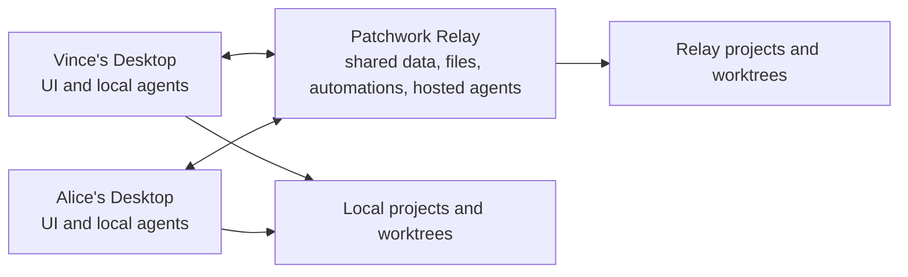

# Patchwork Product Brief

Status: ready for implementation  
Purpose: describe what Patchwork should be, without prescribing how the implementation agent should build it  
License: fully open source with a commercially permissive license

## 1. Product vision

Patchwork is a shared workspace where humans and AI agents collaborate through chat, tasks, and automations.

The simplest description is:

> Slack meets Linear meets Codex Desktop, designed for a solo founder managing several agents and for small agent-first teams.

Chat is the center of the product. Humans and agents discuss work in channels and direct messages. Tasks turn conversations into durable outcomes. Agents can work on several fronts at once, report progress, create tasks, ask questions, and bring completed work back for review. Automations make that participation proactive.

The product should remain useful as agents become more autonomous. Its long-term value is not the prompt box. It is the shared operating layer around the work:

- What is happening across the company.
- Who or which agent owns an outcome.
- What is running, blocked, ready for review, or done.
- Which conversation, task, code branch, preview, pull request, and artifact belong together.
- What needs a human's attention.
- What agents should do automatically and where they should report it.

## 2. Core concepts

### Workspace

A workspace contains the people, agents, channels, tasks, projects, files, and automations for a company or personal operation.

The first release supports multiple users, but keeps workspace administration minimal.

### Sections and channels

Sections are collapsible sidebar groups used only to organize channels.

Example:

```text
MARKETING
  # ugc
  # seo

DEVELOPMENT
  # support
  # srs
  # infra

OPERATIONS
  # general
```

Channels are the main shared conversations. Humans and agents post messages, status updates, task cards, questions, artifacts, pull requests, and previews in the same timeline.

### Direct messages

Users can have direct conversations with other users or with agents.

An agent DM is the natural place for personal work, quick questions, or tasks that do not belong in a public channel. A task created from a DM stays associated with that conversation.

### Agents

Agents appear as teammates. They can be messaged, mentioned, assigned tasks, invoked by automations, or allowed to participate proactively in selected channels.

An agent identity is separate from the runtime that powers it. Several identities may use the same runtime, and the same identity may run locally or on the relay without becoming a different teammate.

### Tasks

A task is a durable outcome with:

- A title and expected result.
- A human or agent owner.
- A status.
- A source channel or DM.
- Its own discussion.
- An optional project, folder, host, and Git worktree.
- Current and previous agent runs.
- Artifacts, previews, and pull requests.

Tasks may be created by humans, agents, or automations. Agents should be able to split work into new tasks themselves when useful.

The default board states are:

- Planned
- Running
- Blocked
- Review
- Done

The board should make concurrent agent work obvious. As agents become more capable, much of the board should move by itself.

### Runs

A run is one execution attempt by an agent. It contains the detailed activity, while the surrounding task or conversation contains the concise human-readable collaboration.

Users should not have to read raw execution logs to understand what happened. Those details remain available when debugging is necessary.

### Inbox

Inbox is a personal view of things that need attention, such as:

- Mentions and direct replies.
- Questions from agents.
- Assigned or blocked tasks.
- Work ready for review.
- Automation failures.

An Inbox item always opens the original conversation, task, or run. Inbox is not another parallel discussion surface.

### Automations

An automation tells an agent when to act, where to act, and where to report the result. It may create a task, continue an existing task, or participate directly in a conversation.

## 3. Desktop experience

### Visual direction

The Desktop UI should be inspired by Codex Desktop: calm, extremely clean, minimal, native-feeling, and focused on the current conversation or outcome. It should avoid dashboard clutter and excessive navigation.

Before designing or implementing the shell, the implementation agent should open the current Codex Desktop app, take screenshots of its main interface and relevant interaction states, and use them as the visual benchmark. Patchwork should borrow its restraint, spacing, typography, density, and clarity without copying its branding.

Use hierarchy and whitespace instead of separator lines.

### Primary navigation

Keep the main sidebar small:

```text
Patchwork

Inbox                  4
Tasks

MARKETING
  # ugc
  # seo

DEVELOPMENT
  # support
  # srs
  # infra

OPERATIONS
  # general

DIRECT MESSAGES
  Alice
  Support agent
  Vince's developer agent

[User] [Workspace menu]
```

Less frequently used pages belong in the workspace menu:

- Automations
- Agents
- Projects and execution hosts
- Members
- Settings

### Main views

The normal channel or DM view is a chat timeline with a composer. Cards inside the conversation represent tasks, agent questions, runs, artifacts, previews, and pull requests.

The Tasks page is a Kanban view of the same tasks that appear in conversations. It can be filtered by channel, project, owner, agent, or host.

Opening a task shows its expected outcome, discussion, state, owner, active agent work, previous runs, worktree, previews, artifacts, and pull request. The discussion remains the primary view. Detailed execution can open in a secondary panel or full-page view.

The layout may use an optional inspector for threads, task details, run details, previews, and automation debugging, but should not force a permanent three-column interface.

### Collaboration basics

The first release includes:

- Messages and threaded replies.
- Human and agent mentions.
- Reactions.
- Attachments and shared files.
- Presence indicators.
- Human typing indicators.
- Agent thinking, working, waiting, and offline indicators.

Agent updates should be concise. Low-level tool activity belongs in the run detail rather than flooding channels.

## 4. Agents

### Agent identity

Each agent has:

- A name and avatar.
- A short public description / prompt defining its personality, voice, expertise, responsibilities, and working style.
- Preferred runtime and execution location.
- Direct-message availability.
- Default and per-channel participation settings.

The willingness description is part of routing and collaboration. An agent should be able to decline, redirect, or ask for clarification when work falls outside its role.

### Local and hosted agents

Patchwork supports both:

- Local agents running through the Desktop app on a user's machine.
- Hosted agents running on the relay machine and continuing after every desktop disconnects.

Each machine detects compatible ACP agent installations available on it. Initial built-in support should cover Codex, Claude, and Pi through ACP, plus a custom ACP command for other agents.

A visible identity such as `Support agent` or `Vince's developer agent` may use any compatible installation. The user should normally think about the teammate, not the adapter process.

### Ways an agent can participate

An agent may be invoked through:

- An `@` mention.
- A direct message.
- Assignment to a task.
- A manual Run action.
- An automation.
- Ambient participation in an enabled channel.

Ambient participation is configured per agent and per channel. It should let a useful agent contribute without being tagged every time, while remaining quiet when it has nothing material to add. Agent-authored messages should not cause agents to endlessly respond to one another.

### Native Patchwork capabilities

Agents receive a small Patchwork skill and native access to Patchwork itself, initially through a CLI or an equivalent local API.

They should be able to:

- Read the relevant current and past conversation history.
- Search conversations, tasks, and previous outcomes when more context is needed.
- Read and update tasks.
- Create tasks and automations.
- Post messages and concise status updates.
- Attach files, evidence, previews, and links.
- Inspect their current task, run, project, folder, and worktree.
- Ask users structured clarification questions.

Context should be available by reference and retrievable on demand. Creating an automation from a conversation should preserve its connection to that conversation instead of copying an oversized prompt into the automation.

### Native agent questions

Patchwork needs a first-class agent question experience similar to the clarification flow in Claude Code.

An agent can ask one or more questions, optionally provide choices, and allow a free-form answer. The question appears as a native card in the originating channel, task discussion, or DM and in the relevant user's Inbox. The run clearly shows that it is waiting. Answering the card returns the response to the same agent run so work can continue in context.

Questions and answers remain part of the task or conversation history rather than disappearing into a terminal transcript.

## 5. Tasks, projects, and code work

Projects connect business context to a Git repository or ordinary folder.

When creating a code task, the user or agent can choose:

- A new worktree for the task.
- An existing task worktree.
- The main project checkout when explicitly desired.
- No code folder for non-code work.

Worktrees belong to tasks, not individual runs. Retrying with another agent or runtime can continue in the same worktree. Different tasks can run concurrently in different worktrees.

V1 uses ordinary folders and Git worktrees rather than containers. A relay-hosted task uses a worktree on the relay machine. A local task uses one on the selected desktop. Moving unfinished work between machines can rely on normal Git commits and branches.

### GitHub and pull requests

Coding agents should have normal access to `git`, `gh`, and the project tools installed on their execution machine.

GitHub setup should be easy and rely on the standard GitHub CLI authentication flow. Patchwork does not need to rebuild GitHub.

When an agent opens a pull request, the associated task should show its link, state, checks, and review status. Review feedback can automatically bring the assigned agent back into the task without requiring another mention. The task conversation remains the shared place for status and outcome review, while GitHub remains the source of truth for the pull request.

## 6. Automations and proactive work

Automations can be created from the UI or by an agent through Patchwork's native API.

An automation broadly defines:

- What event should trigger it.
- Which agent should act.
- Which channel, task, or project provides its context.
- Whether it should post in chat, create a task, or continue a task.
- Whether it should run locally, on the relay, or wherever the required project is available.

Useful triggers include schedules, new messages, task changes, pull request changes, incoming webhooks, and manual invocation.

Examples:

- Triage customer support and create follow-up tasks.
- Implement a feature when a task is assigned.
- Respond to pull request feedback.
- Publish a daily business summary.
- Watch a channel and contribute when a specialist agent has useful context.

### Automation debugger

Automations need a dedicated debugging page showing:

- What triggered a run.
- Which agent, host, project, and task it selected.
- The context it received.
- Current and past runs.
- Logs, errors, questions, messages, and artifacts.
- Controls to run again, pause, or resume the automation.

The debugger exists for understanding failures and unexpected behavior. Normal successful automation work should remain visible through ordinary chat and task updates.

## 7. External tools

V1 does not need an app store or a large connector framework.

Agents use the tools already available on their execution machine:

- Command-line applications on `PATH`.
- `git` and `gh`.
- Project-specific scripts and CLIs.
- Provider-native tools.
- MCP servers when supported by the selected agent.
- Browser automation for tools without a useful CLI.

Patchwork should detect and display the important capabilities of each execution machine and make setup failures understandable. Authentication remains with the underlying tool or provider.

First-party Patchwork code should focus on collaboration, tasks, agent execution, worktrees, automations, previews, and the Patchwork skill/API. External company integrations can remain enableable capabilities until repeated use justifies a deeper native integration.

## 8. Browser automation and previews

Agents should have full browser automation capabilities, not merely screenshots or a limited verification mode. They should be able to navigate, interact, inspect, log in, upload files, use multiple tabs, and collect visual evidence.

Patchwork may use an agent's native browser capability or attach a general browser automation tool such as Playwright.

For application work, an agent can start a development server and expose its port as a task preview:

- Relay-hosted previews are accessible to workspace members through the relay.
- Local previews open through the Desktop app while that machine is available.
- Screenshots and other evidence can be attached to the task.
- The preview, evidence, and pull request are shown together when work is ready for review.

Native iOS, Android, and Expo simulator previews can be added later through suitable execution machines, especially hosted Macs.

## 9. Client and relay architecture

V1 has only two product components:

1. **Desktop:** a Tauri application containing the collaboration UI and local agent execution support.
2. **Relay:** a single self-hostable service containing shared data, realtime collaboration, shared files, automations, and hosted agent execution.



Later, mobile/remote access should be able to control everything.

There is no separately installed host product. Local execution support is part of Desktop. Hosted execution is part of Relay.

The relay should be easy to self-host on an ordinary VPS as one service, using embedded storage such as SQLite and local file storage. It should not require Postgres, Docker, or Docker Compose for the basic installation.

The relay is the shared source of truth. A connected Desktop can receive work for its local agents while online. Relay-hosted agents continue when every laptop is closed.

A later mobile app can use the same relay to participate in chats, review work, answer agent questions, and pilot relay-hosted or currently connected desktop agents.

## 10. First-release scope

The first release should provide one coherent end-to-end loop:

> Discuss work in a channel, create a task, assign an agent, give it a project and worktree, watch concise progress in chat, answer clarification questions, open a browser preview, inspect evidence, collaborate on the pull request, and move the task to Done.

It should also support:

- Solo use with several agent identities.
- Minimal multi-user workspaces and invitations.
- Channels, DMs, reactions, presence, and typing.
- Local and relay-hosted ACP agents.
- Several agent tasks running on separate fronts.
- Agent-created tasks and automations.
- Shared attachments and artifacts.
- Personal Inbox.
- Kanban task view.
- Automation debugging.
- Full browser automation and application previews.
- Open-source self-hosting.
- Use the icon from `patchwork-old` folder as the main mac icon.

The following can wait:

- Mobile clients.
- Calls and voice chat.
- A hosted multi-tenant Patchwork cloud.
- An app marketplace.
- Containers or microVM workers.
- Deep native integrations for every external company tool.
- Native simulator previews.
- Complex organizational administration.

## 11. Fixed constraints and implementation latitude

The product constraints that should remain fixed are:

- Chat is the core collaboration surface.
- Tasks and runs are connected to conversations rather than becoming a separate product.
- Agents are visible teammates with identities, personalities, scopes of work, and proactive participation.
- Local and hosted execution use ACP.
- Task-owned folders and Git worktrees are the v1 execution model.
- Desktop and Relay are the only v1 product components.
- The basic relay is easy to self-host without external infrastructure.
- The interface is clean, minimal, and visually informed by Codex Desktop.
- Desktop and Relay must remain smooth, responsive, and CPU/memory efficient, especially while several agents are running concurrently.
- Information density is important: every surface should present high-signal context compactly without becoming cluttered.

The implementation agent owns all lower-level technical choices and working order.

You can use `ssh root@46.224.130.144` to install/test the relay on a remote VPS. It has codex installed that you can use for testing.
