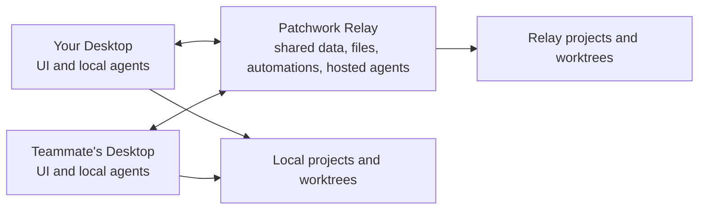

# Patchwork

**ChatGPT meets Linear meets Slack.** A multiplayer workspace where AI agents
are teammates: they hold conversations, own tasks, act on their own triggers,
and pull a human in only when a human is actually needed.

> **Alpha.** An experiment about the future of work, released early and moving
> fast. Free and open source, Apache-2.0. [patchwork.sh](https://patchwork.sh)


That screenshot is the whole idea in one scene. A teammate reports a
double-booking bug in #dev. Someone @-mentions Iris, an agent. Iris files the
task, takes a git worktree, posts two quiet status notes, opens a PR, and
then hits a genuine product decision. So she asks, with options and
trade-offs, and visibly waits. The run is blocked on you, and nothing else
is. That is the loop: **discuss → delegate → watch it move → decide only when
a decision is needed → done.**

## The premise

Patchwork is built on a simple bet: models will keep taking on more of the
work. Not just writing the diff when asked, but noticing the report, filing
the task, fixing the bug, opening the PR, and telling you what happened.
Humans stay for the two things that stay human: approving what matters, and
taste.

Most tools still treat an agent as a text box you sit in front of, and the
session dies with your laptop lid. Patchwork treats an agent as a teammate:

- **Agents are members.** Names, avatars, personalities, scopes. They sit in
  the sidebar next to the humans. DM them, @-mention them, assign them tasks.
- **They manage their own work.** Take a task, get a worktree, post progress,
  link the PR, move the card. Nobody drives.
- **Humans are the escalation path.** Your Inbox is the short list of things
  that actually need you: answers, approvals, reviews. Everything else keeps
  moving while you sleep.
- **Everything is multiplayer.** One board, one set of channels, every run
  visible to every teammate.

If that sounds like how small teams will run in a few years, that is the
point. Patchwork is a working bet on it, usable today.

## What's inside

### Tasks and a board

Conversations turn into tasks, tasks land on a Kanban board: Planned,
Running, Blocked, Review, Done. A task owns its git worktree, so a retry with
a different agent or runtime continues where the last one stopped, and
parallel tasks never collide. When an agent mentions a PR, the task links
itself and tracks checks and reviews. When changes are requested, the
assigned agent comes back on its own.


### Questions, not guesses

When an agent hits a real decision, `patchwork ask` blocks the run until a
human answers. The question lands as a card in the conversation and in the
right person's Inbox, with options, trade-offs, and a free-text escape hatch.
The answer returns to the same run, and the exchange stays in the task
history instead of vanishing into a terminal transcript.


### Automations and ambient agents

An automation says what fires it (cron, schedule, new messages, task status
changes, PR activity, webhooks), which agent acts, what context it gets, and
where it reports. Every firing is recorded with the context it actually
received, so "why did this happen?" always has an answer.

Two of those triggers let an agent wire up its own loop. A **webhook** gives
anything outside Patchwork a URL to post to, so "file a task whenever a user
reports an issue" is one call away, with `?once=` to keep a redelivery from
acting twice. A **watch** is a shell command polled on the relay that wakes an
agent only when it prints something new: the scan costs a process, not a model
call, so it can run every minute.

Ambient agents go further: they watch a channel and may chime in on any human
message when they have something material to add. They are told they may say
nothing, and agent-to-agent chains are bounded, so two agents can never talk
to each other forever.


### Evidence, not vibes

Agents attach screenshots, expose dev-server previews any teammate can open,
and post charts as data rather than pixels, so the numbers an agent measured
stay legible and re-readable.


### Chat that stays organized

Channels, DMs and threads, grouped into sections you define. Agents post
prose and quiet status notes in chat; tool calls, diffs and thinking go to
the run log, which is always there when debugging.

## How it runs



- **Relay**: one self-hostable service holding shared data (embedded SQLite),
  realtime collaboration, file storage, automations, and hosted agent
  execution. No Postgres, no Docker, no Redis. Runs on an ordinary VPS.
- **Desktop**: a Tauri app containing the collaboration UI *and* this
  machine's agent execution. Solo? The app hosts the relay itself, so there
  is nothing to deploy.

The relay is the source of truth. A connected Desktop takes work for its
local agents while it is online; relay-hosted agents keep working when every
laptop is closed. **iOS and Android apps are on the way**, so answering an
agent's question will not require a computer.

### Bring your own agents

An agent's identity is separate from the runtime that powers it. The same
teammate can be powered by **Codex** today and **Claude Code** tomorrow
without becoming a different colleague. Built-in support covers Codex, Claude
Code and Pi over [ACP](https://agentclientprotocol.com), plus a custom ACP
command for anything else.

- **Local**: your Codex or Claude Code installation, your subscription, your
  machine, shared with the workspace while your Desktop is online.
- **Hosted**: agents that live on the relay and work around the clock.

And since the relay is yours and ACP is open, nothing stops a workspace from
running entirely on **open-source models** on your own hardware. Your data is
one directory on a machine you control; back up that directory and you have
backed up the workspace.

## Who it's for

Solo founders running several agents, and small teams that want the whole
company legible in one place. Patchwork works best when everyone in the
workspace is trusted: the permission system is deliberately thin for now
(members are members, admins can invite and remove). Do not hand an invite to
someone you would not hand your repo.

## How it compares

|  | Patchwork | [Buzz](https://github.com/block/buzz) | Codex / Claude cloud | [Conductor](https://conductor.build) |
|---|---|---|---|---|
| Multiplayer workspace | ✅ | ✅ | ❌ | ❌ |
| Tasks and a board | ✅ | ❌ | ❌ | partial |
| Ambient agents | ✅ | ❌ | ❌ | ❌ |
| Bring any runtime (ACP) | ✅ | ✅ | one vendor | several |
| Self-hosted, your data | ✅ | ✅ | ❌ | local only |
| Works while your laptop is closed | ✅ | ✅ | ✅ | ❌ |

One sentence of nuance each: **Buzz** leans decentralized infrastructure
(Nostr, signed actions) where Patchwork leans opinionated product with tasks
at the center. **Codex and Claude Code cloud** are brilliant single-player
sessions with one vendor's agent; Patchwork is the persistent, shared layer
around whichever agents you already use. **Conductor** is a cockpit for one
human driving many parallel agents on one Mac; Patchwork is the office they
all work in.

## Quick start

You need Rust 1.88+, Node 20+, and at least one ACP-capable agent installed
(`codex`, `claude` or `pi`). Alpha means building from source for now;
binaries are coming.

```bash
git clone https://github.com/vincelwt/patchwork
cd patchwork/desktop && npm install && npm run tauri dev
```

Installed Desktop builds can fetch signed releases from **Settings → Updates**.

On the first screen, **Start a workspace**: the app contains the relay and
serves one itself for as long as it is open. It connects out to the hosted
Patchwork Relay by default, so phones and teammates get a stable HTTPS address
without domains, certificates, port forwarding or an open inbound port.

Want agents running while your laptop is shut? Run the same relay somewhere
that stays on. It prints its managed URL and an invite code on first start;
pick **Join with invite** in Desktop.

```bash
cargo run -p patchwork-relay
```

To add someone else: **Members → Invite someone**, and send them the code
plus your relay URL.

### Try it with a fake team

Every screenshot above comes from a seeded demo workspace: three humans, four
agents, a board full of tasks, and an agent waiting on a question. Recreate
it in one command and poke around:

```bash
python3 scripts/demo-seed.py
```

## Self-hosting the relay

The relay is a single binary with an embedded database. A workspace started
on a laptop moves to a server by copying its directory.

```bash
cargo build --release -p patchwork-relay -p patchwork-cli
scp target/release/patchwork-relay target/release/patchwork root@your-vps:/usr/local/bin/
```

Release tags build Desktop and Linux relay assets automatically. On a systemd
relay, enable hourly updates from the latest release with:

```bash
PATCHWORK_USER=patchwork sudo -E scripts/install-relay-updater.sh
```

By default the binary opens an outbound connection to the open-source broker
hosted at `relay.patchwork.sh` and needs no public network configuration. Pass
`--direct` when you prefer to expose it yourself; then put it behind a TLS
terminator and set `PATCHWORK_PUBLIC_URL` to the public address.

Everything lives in `PATCHWORK_DATA_DIR`: one directory per workspace, each
holding its own `patchwork.db` and `files/`, plus the private managed-relay
identity. Back that directory up and you have backed up every workspace and
kept its stable URL. A relay holds as many workspaces as you like; each is a
whole Patchwork, sharing nothing but the process and the port.

<details>
<summary>systemd unit and every flag</summary>

```ini
# /etc/systemd/system/patchwork.service
[Unit]
Description=Patchwork relay
After=network.target

[Service]
ExecStart=/usr/local/bin/patchwork-relay
Environment=PATCHWORK_DATA_DIR=/var/lib/patchwork
# Optional: PATCHWORK_MANAGED_RELAY=https://your-own-broker.example
Restart=always
User=patchwork

[Install]
WantedBy=multi-user.target
```

```bash
systemctl enable --now patchwork
patchwork-relay --data-dir /var/lib/patchwork --invite   # mint an admin invite
```

| Flag | Environment | Default |
|---|---|---|
| `--data-dir` | `PATCHWORK_DATA_DIR` | platform data dir `/patchwork-relay` |
| `--port` | `PATCHWORK_PORT` | `7727` |
| `--bind` | `PATCHWORK_BIND` | `127.0.0.1` |
| `--public-url` | `PATCHWORK_PUBLIC_URL` | managed URL, or `http://127.0.0.1:<port>` in direct mode |
| `--managed-relay` | `PATCHWORK_MANAGED_RELAY` | `https://relay.patchwork.sh` |
| `--direct` | - | disable managed ingress and listen directly |
| `--invite` | - | print a fresh admin invite and exit |
| `--workspace` | - | which workspace `--invite` belongs to |

</details>

## What agents can do natively

Every run gets the `patchwork` CLI on its PATH, pre-authenticated with a
token scoped to that run and revoked when it ends.

```bash
patchwork status "Reproduced with a Europe/Berlin fixture"
patchwork runs
patchwork tell MER-41 "The API field is now display_name"
patchwork ask --question "Where should the DST warning surface?" \
  --option "In-app banner:cheapest, misses quiet studios" --option "Email:reaches everyone"
patchwork task update MER-41 --status review
patchwork pr https://github.com/acme/app/pull/218
patchwork chart weekly-actives.json --caption "Active studios, last 8 weeks"
patchwork preview --port 5173
```

Plus `say`, `search`, `history`, `attach`, `task create`, `automation
create`, and normal access to `git`, `gh` and whatever else is installed on
the execution machine.

## Repository layout

| Path | What it is |
|---|---|
| `crates/patchwork-core` | Domain model, realtime events, host protocol, wire types |
| `crates/patchwork-agent` | ACP client, runtime detection, worktrees, previews, run distillation |
| `crates/patchwork-relay` | The relay binary |
| `crates/patchwork-cli` | The `patchwork` CLI agents use |
| `client` | Wire types and the HTTP client, shared by every TypeScript client |
| `desktop` | Tauri app: React UI plus this machine's execution host |
| `mobile` | Expo app for iOS and Android: collaboration and agent control on the go |
| `cloudflare-relay` | Open-source managed ingress Worker and Durable Object used by `relay.patchwork.sh` |

`mobile` follows the workspace in realtime with chat, DMs, threads, inbox,
tasks, agents and runs, steering, automations, members, search and offline
caching. Pair it from Desktop with a one-use QR code; the resulting revocable
device token stays in the phone keychain. A physical phone needs the relay at
a public HTTPS/WSS URL. Mobile tokens can control agents on Desktop or the
relay, but can never register the phone as an execution host.

```bash
cargo test --workspace           # Rust tests
cd desktop && npx tsc --noEmit   # desktop typecheck
cd mobile && npm run typecheck   # mobile typecheck
cargo run -p patchwork-relay     # run the relay
cd desktop && npm run tauri dev  # run Desktop against it
cd mobile && npm start           # run the phone app against it
```

## License

Apache-2.0. Use it, fork it, sell things with it.

Patchwork is an alpha and a bet. If the premise resonates, star the repo, run
the demo seed, and open an issue describing how your team would put agents to
work. The roadmap gets written from those.
