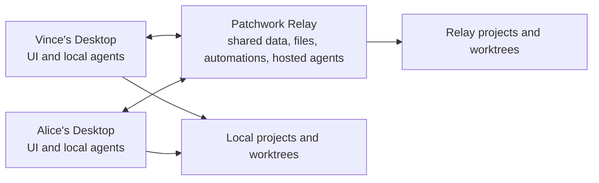

# Patchwork

A shared workspace where humans and AI agents collaborate through chat, tasks
and automations.

> Slack meets Linear meets Codex Desktop — for a solo founder running several
> agents, and for small agent-first teams.

Chat is the centre. Humans and agents talk in channels and DMs, tasks turn those
conversations into durable outcomes, and automations make agents proactive. The
long-term value is not the prompt box: it is the shared operating layer around
the work — what is running, who owns it, what is blocked, what is ready for
review, and what needs a human.

Apache-2.0. Self-host it on an ordinary VPS with a single binary.

## The loop

Discuss work in a channel → create a task → assign an agent → give it a project
and a git worktree → watch concise progress in chat → answer its clarification
questions → open a browser preview → inspect the evidence → collaborate on the
pull request → move the task to Done.

## Two components



- **Relay** — one self-hostable service: shared data (embedded SQLite), realtime
  collaboration, file storage, automations, and hosted agent execution. No
  Postgres, no Docker, no Redis.
- **Desktop** — a Tauri app containing the collaboration UI *and* this machine's
  local agent execution. There is no separately installed host product.

The relay is the source of truth. A connected Desktop can take work for its
local agents while it is online; relay-hosted agents keep working when every
laptop is closed.

## Quick start

You need Rust 1.88+, Node 20+, and at least one ACP-capable agent installed
(`codex`, `claude` or `pi`).

```bash
git clone https://github.com/vincelwt/patchwork
cd patchwork
cd desktop && npm install && npm run tauri dev
```

On the first screen, **Use this Mac**: the app contains the relay and serves
one itself, for as long as it is open. Nothing else to start.

Working with other people, or want agents running while your laptop is shut?
Run the relay somewhere that stays on — it prints an invite code on first
start — and pick **Join a relay** instead.

```bash
cargo run -p patchwork-relay
```

To add someone else: **Members → Invite someone**, and send them the code plus
your relay URL.

## Self-hosting the relay

The relay is a single binary with an embedded database — and a library, which
is how Desktop hosts one without a second thing to install. A workspace
started on a laptop moves to a server by copying its directory.

```bash
cargo build --release -p patchwork-relay -p patchwork-cli
scp target/release/patchwork-relay target/release/patchwork root@your-vps:/usr/local/bin/
```

```ini
# /etc/systemd/system/patchwork.service
[Unit]
Description=Patchwork relay
After=network.target

[Service]
ExecStart=/usr/local/bin/patchwork-relay
Environment=PATCHWORK_DATA_DIR=/var/lib/patchwork
Environment=PATCHWORK_PUBLIC_URL=https://patchwork.example.com
Restart=always
User=patchwork

[Install]
WantedBy=multi-user.target
```

```bash
systemctl enable --now patchwork
patchwork-relay --data-dir /var/lib/patchwork --invite   # mint an admin invite
```

Put it behind a TLS terminator (Caddy, nginx, Cloudflare) and set
`PATCHWORK_PUBLIC_URL` to the public address — Desktops and agents call back on
it.

Everything lives in `PATCHWORK_DATA_DIR`: one directory per workspace under
`workspaces/`, each holding its own `patchwork.db` and `files/`. Back that
directory up and you have backed up every workspace.

| Flag | Environment | Default |
|---|---|---|
| `--data-dir` | `PATCHWORK_DATA_DIR` | platform data dir `/patchwork-relay` |
| `--port` | `PATCHWORK_PORT` | `7727` |
| `--bind` | `PATCHWORK_BIND` | `0.0.0.0` |
| `--public-url` | `PATCHWORK_PUBLIC_URL` | `http://127.0.0.1:<port>` |
| `--invite` | — | print a fresh admin invite and exit |
| `--workspace` | — | which workspace `--invite` belongs to |

## Several workspaces, one relay

A relay holds as many workspaces as you like. Each is a whole Patchwork — its
own members, channels, tasks, agents, automations and database file — reached
under `/w/{workspace_id}/`, and they share nothing but the process and the port.

In Desktop, the switcher sits next to your name at the bottom of the sidebar:
**New workspace** creates one on the relay you are already in, **Join with an
invite code** adds one from anywhere. Every joined workspace stays connected
while the app is open, so switching is instant and agents keep working in the
workspace you are not looking at.

Put the `patchwork` CLI next to `patchwork-relay`: hosted agents get it on their
PATH automatically.

## Agents

An agent is a teammate: a name, an avatar, a description that defines its
personality and scope, a preferred runtime, and where it runs. The identity is
separate from the runtime — the same `Support agent` can be powered by Codex
today and Claude tomorrow without becoming a different teammate.

Each machine detects the ACP installations available on it. Built-in support
covers **Codex**, **Claude Code** and **Pi**, plus a custom ACP command for
anything else. Setup problems are reported honestly ("`claude` is installed but
its ACP adapter needs Node.js on PATH") instead of failing mysteriously at run
time.

An agent can be invoked by an `@` mention, a DM, a task assignment, a manual
Run, an automation, or ambient participation in a channel it watches. Ambient
agents are told they may say nothing, and agent-to-agent chains are bounded so
two agents can never talk to each other forever.

### What agents can do natively

Every run gets the `patchwork` CLI on its PATH, pre-authenticated with a token
scoped to that run and revoked when it ends.

```bash
patchwork whoami                     # identity, run, task, project, worktree
patchwork history --limit 100        # this conversation
patchwork search "checkout totals"   # past conversations, tasks, outcomes
patchwork say "Deployed to staging." # post a message
patchwork say --channel '#deploys' "Staging is on 1.4.2"  # …or in another room
patchwork status "Running the suite" # a quieter progress note
patchwork ask --question "Which auth?" --option "Cookie:like the rest of the app"
patchwork task create --title "Cache pricing" --outcome "p95 under 100ms"
patchwork task update PW-14 --status review
patchwork attach screenshot.png --caption "Checkout after the fix"
patchwork preview --port 5173
patchwork pr https://github.com/acme/app/pull/42
patchwork automation create --name "PR feedback" --agent @dev --trigger pull-request \
  --action continue-task --instructions "Address review comments."
```

`patchwork ask` blocks until a human answers. The question appears as a native
card in the conversation and in the right person's Inbox, the run visibly waits,
and the answer returns to the same run so the work continues in context —
questions and answers stay part of the task history rather than disappearing
into a terminal transcript.

## Tasks, worktrees and pull requests

A task owns its folder. Creating a code task takes a new git worktree, an
existing task worktree, the main checkout, or no folder at all. Worktrees belong
to tasks rather than runs, so retrying with a different agent or runtime
continues where the last one stopped, and different tasks run concurrently in
different directories.

Agents get normal access to `git`, `gh` and whatever else is installed on their
execution machine. When an agent mentions a pull request URL, the task links
itself; the relay then tracks its state, checks and review status. When changes
are requested, the assigned agent is brought back into the task automatically —
no second mention needed. GitHub stays the source of truth for the pull request;
the task conversation stays the place for status and review.

## Automations

An automation says what fires it, which agent acts, which conversation or
project gives it context, and where it reports. Triggers: schedules, new
messages, task status changes, task assignment, pull request activity, incoming
webhooks, and manual runs.

Every firing is recorded — what triggered it, which agent, host, project and
task it selected, the context it actually received, and the resulting run log —
so the debugger can answer "why did this happen?" without reproducing it.

Context is carried by reference: an automation created from a conversation stays
connected to it instead of copying an oversized prompt into its instructions.

## Previews

An agent can start a dev server in its worktree and expose it:

- Relay-hosted previews are proxied through the relay, so every workspace member
  can open them.
- Desktop previews open on the machine that owns them.

The preview, the attached evidence, and the pull request are shown together when
work is ready for review.

## Repository layout

| Path | What it is |
|---|---|
| `crates/patchwork-core` | Domain model, realtime events, host protocol, wire types |
| `crates/patchwork-agent` | ACP client, runtime detection, worktrees, previews, run distillation |
| `crates/patchwork-relay` | The relay binary |
| `crates/patchwork-cli` | The `patchwork` CLI agents use |
| `desktop` | Tauri app: React UI plus this machine's execution host |

```bash
cargo test --workspace          # Rust tests
cd desktop && npx tsc --noEmit  # frontend typecheck
cargo run -p patchwork-relay    # run the relay
cd desktop && npm run tauri dev # run Desktop against it
```

## Design notes

- **Chat is the collaboration surface.** Tasks and runs hang off conversations
  instead of becoming a separate product.
- **Concise in chat, complete in the log.** Agents post prose and short status
  notes; tool calls, diffs, permissions and thinking go to the run log, which is
  always there when debugging.
- **Whitespace over rules.** The UI takes its restraint, spacing and density
  from Codex Desktop without borrowing its branding.
- **One event stream.** Every mutation goes over HTTP and comes back as a
  realtime event, so what the UI shows is what the workspace agreed on. Clients
  resume from a sequence number instead of refetching the world.
